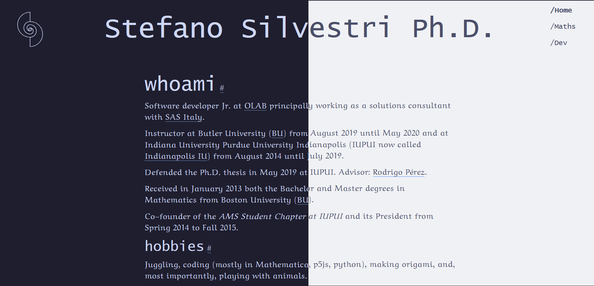

# SilvestriStefano.github.io



## :seedling: Carbon footprint
According to [Websitecarbon.com](https://www.websitecarbon.com) I achieve a carbon rating of **A<sup>+</sup>** on all pages. 

The estimated carbon footprint for my
- [Home](https://www.websitecarbon.com/website/silvestristefano-github-io/) page is of 0.01g of CO<sub>2</sub> 
- [Maths](https://www.websitecarbon.com/website/silvestristefano-github-io-maths/) page is of 0.05g of CO<sub>2</sub> 
- [Maths/Graduate](https://www.websitecarbon.com/website/silvestristefano-github-io-maths-research-grad/) page is of 0.05g of CO<sub>2</sub> 
- [Maths/Undergraduate](https://www.websitecarbon.com/website/silvestristefano-github-io-maths-research-ugrad/) page is of 0.05g of CO<sub>2</sub> 
- [Maths/Teaching](https://www.websitecarbon.com/website/silvestristefano-github-io-maths-teaching/) page is of 0.01g of CO<sub>2</sub>
- [Developer](https://www.websitecarbon.com/website/silvestristefano-github-io-dev/) page is of 0.03g of CO<sub>2</sub>

## Website Info

### Goals
I built the website with the following goals in mind:
- [ ] be accessible (see [A11yProject](https://a11yproject.com) and [WAVE](https://wave.webaim.org/))
- [ ] be responsible of the environment (see [WebsiteCarbon](https://websitecarbon.com) and [LowTechMagazine](https://solar.lowtechmagazine.com))
- [ ] have good SEO

So far, I am happy with the results, but alas, it is always a work in progress.

### Static Site
This website was built using the wonderful Static Site Generator [11ty](https://11ty.dev). It started with **v1** back in February 2023, in May 2023 I upgraded to **v2.0.1**, in May 2024 I upgraded to **v3.0.0-alpha.10**, and finally in October to **v3.0.0**. Also in July 2024 I switched to using ESM from CJS.

#### 11ty Plugins
- [@11ty/eleventy-img](https://github.com/11ty/eleventy-img) v5.0.0
- [@11ty/eleventy-navigation](https://github.com/11ty/eleventy-navigation/) v0.3.5

#### Other dependencies
- [markdown-it](https://github.com/markdown-it/markdown-it) v14.1.0 with the following plugins
  - [markdown-it-anchor](https://github.com/valeriangalliat/markdown-it-anchor) v9.2.0
  - [markdown-it-mathjax3](https://github.com/wekan/markdown-it-mathjax3) v4.3.2

### Fonts

<details>
  <summary>Details</summary>
  
I have decided to go with **Neo-Euler** with a fallback to **Palatino Linotype**. The first font is used often in the mathematics community: it is extremely lightweight, as it has only one style, and it is beautiful. The fallback font has similar style and it is installed already on most (if not all) computer. 

For the headings I have decided to use **Lucida Console** which is a monospace font available on every computer as well.

Fun facts:
1. Hermann Zapf designed both Neo Euler and Palatino. 
2. Donald Knuth assisted in the creation of Neo Euler.

#### Web Fonts

You can donwload Neo Euler from [fontSpace](https://www.fontspace.com/neo-euler-font-f39945) or [fontLibrary](https://fontlibrary.org/en/font/euler-otf)

I used [FontSquirrel](https://fontsquirrel.com) to create the webfont (`.woff`  and `.woff2` extension)

#### CLS
Be careful of the Cumulative Layout Shift (CLS) that font loading can cause. See [this article on font fallbacks](https://developer.chrome.com/blog/font-fallbacks/). Below is how I dealt with it in my case.

```css
@font-face{
    font-display: swap; /* uses the fallbacks while the font is downloading */
    font-family: 'NeoEuler'; /* the name you want to use */
    src:url("/assets/fonts/neoeuler.woff2") format('woff2'), /* use the lightest first */
        url("/assets/fonts/neoeuler.woff") format('woff');
    size-adjust: 114.14473684210%; /* avgCharacterWidth of web font / avgCharacterWidth of fallback font */
    ascent-override: 64.93605907781%; /* web font ascent / (web font UPM * size-adjust) */
    descent-override: 21.30313400576%; /* web font descent / (web font UPM * size-adjust) */
    line-gap-override: 0%; /* web font line-gap / (web font UPM * size-adjust) */
}
:root{
    /* other code ...*/
    --ff-serif:'NeoEuler','Palatino Linotype',serif;
}
```
</details>

### Fluid Type Scale

I used the following fluid type scale form [utopia.fyi](https://utopia.fyi/type/calculator?c=320,16,1.2,1024,16,1.414,5,0,&s=0.75|0.5|0.25,1.5|2|3|4|6,s-l&g=s,l,xl,12). However, I decided to not use the `clamp()` property, since Safari 12.1 doesn't support it.

*Reference*: https://moderncss.dev/generating-font-size-css-rules-and-creating-a-fluid-type-scale (as of 2023-02-01 last updated on June 6th 2021).

### Color Palette
I have decided to go with [Gruvbox](https://github.com/morhetz/gruvbox) Light and Dark palettes.

### Logo
I have designed the logo myself. It is a doodle I used to do when bored. Obviously I did the math behind it and learned how to create svgs just so I could put it on the website. Eventually I will write a note about it on the website.
